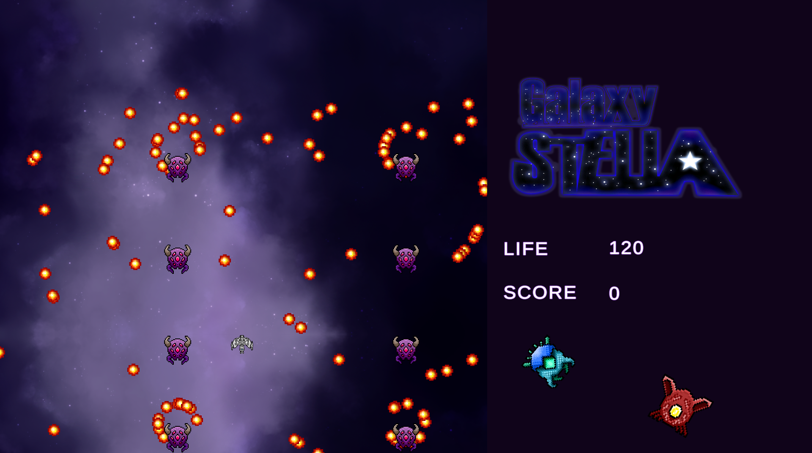
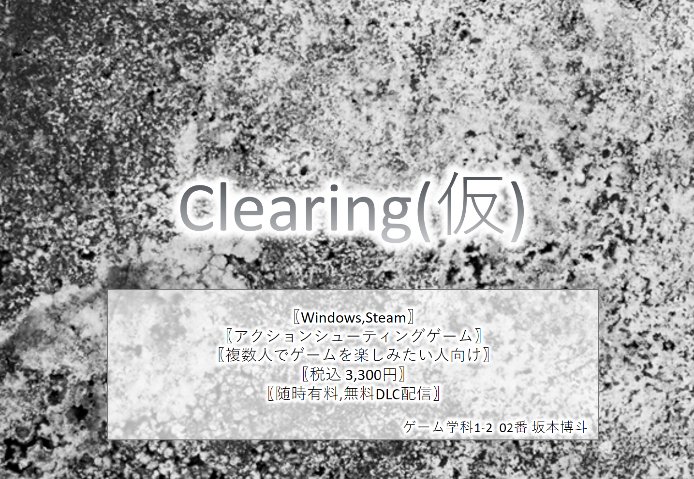
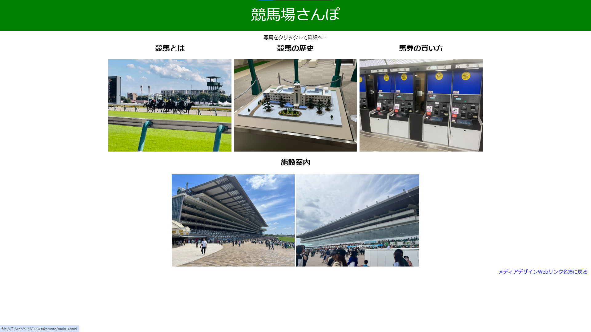
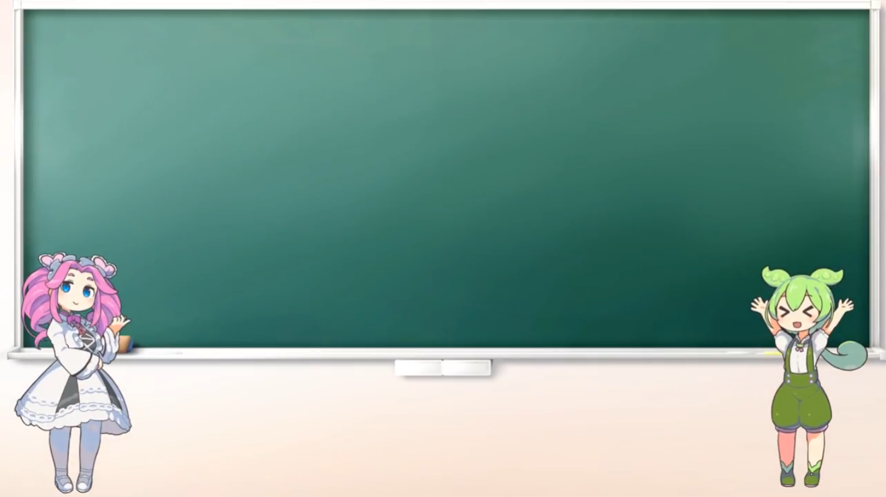

- 坂本 博斗
- 連絡先 Email [sakamodat.1.2.2@gmail.com](sakamodat.1.2.2@gmail.com)
- 埼玉県立伊奈学園総合高等学校 2024年3月卒業
- 専門学校デジタルアーツ東京 ゲームプログラムコース 2026年3月卒業予定

## スキル
- C#
  - 利用歴半年
  - Visual Studioで簡単なプログラムを開発可能
- Unity
  - 利用歴半年
  - チーム作品の開発経験あり
- C/C++
  - 利用歴半年
  - コンソールで簡単なデータ処理プログラムを開発
- HTML
  - 利用歴1年
  - 簡単なWebサイトを製作可能

## 取り組んでいるテーマ
1. オリジナルゲーム開発

## 作品リスト

### GalaxySTELLA

[GalaxySTELLA](リンク)

侵略してくる地球外生命体を倒していく2Dシューティングゲーム。

- 開発環境：Unity2021.3.4f1
- 開発期間：2024/9/5-11/9
- グループ開発作品。DATフェスタにて展示
- サポートとして参加し、背景のスクロールと敵のスポナーのシステムを担当

### 水中探索

[水中探索](リンク)

相棒のドローンで敵を倒しながら進んでいく、横スクロールアクション。

- 開発環境：Mind Render ver2.2.27.0
- 開発期間：2024/8/23-2024/9/5
- Mind Renderにて公開中

### Clearing(仮)企画書

[Clearing(仮)企画書](Clearing_Plan.pdf)

汚れと敵を<お掃除>する、4対4のアクションシューティングゲーム。

- 開発環境：Power Point
- 開発期間：2024/11/15-2024/1/10
- あらすじ 
　<blockquote>あらゆる人たちによって放置されたこの世界… 
　ときには、インクをまき散らされたまま、 
　またときには、大乱闘の跡が残ったまま、 
　そしてまたときには、壺を蹴り割られ、本棚は奪われたまま、 
　こんな世界でもまた来る人たちのために 
　綺麗に＜お掃除＞しなければなりません。  
　何も掃除だけをすればいいとは言っていません。 
　中には掃除の仕事を奪ってくるモノたちもいます。 
　そのモノたちよりも綺麗にするか 
　そのモノたちを綺麗にするか 
　それはあなたの選択次第です。  
　それでは、楽しい＜お掃除＞ライフを・・・ </blockquote>

### 競馬場さんぽ

[競馬場さんぽ](keiba/index.html)

- 開発言語：HTML
- 開発期間：2023/9/24-2023/11/23
- 高校生のときに授業の課題としてwebページを作成

### 三送会

[三送会](https://drive.google.com/file/d/1iCfl2gja9vplBYmSSZwu5W2U0gvNNcYy/view?usp=sharing)

- 開発環境：VideoProc Vlogger
- 開発期間：2023/2/18-2023/3/10
- 高校生のときに後輩に依頼され、別のハウスの3年次へ向け作成

## 連絡先
- E-mail [sakamodat.1.2.2@gmail.com](sakamodat.1.2.2@gmail.com)