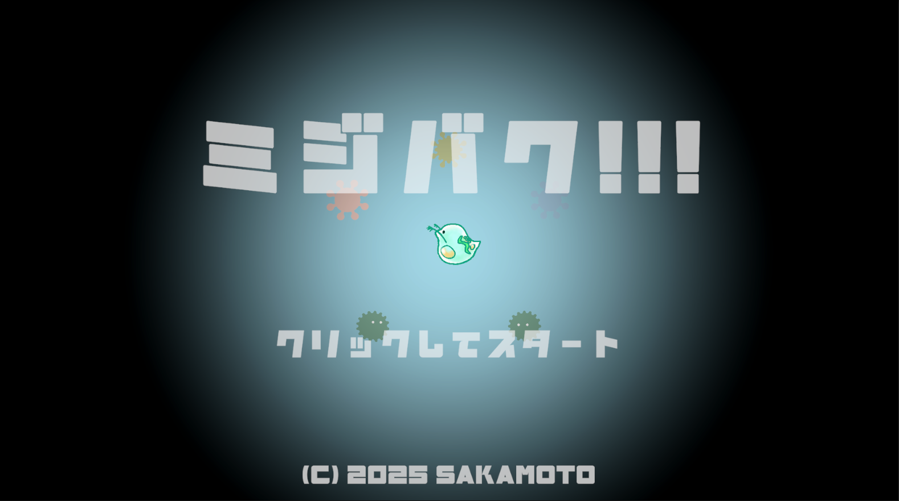
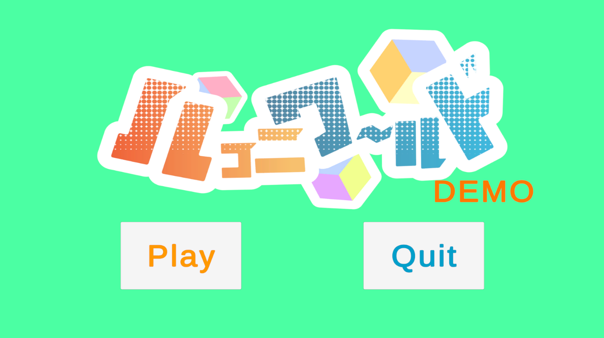

- 坂本 博斗
- 連絡先 Email [sakamodat.1.2.2@gmail.com](sakamodat.1.2.2@gmail.com)
- 埼玉県立伊奈学園総合高等学校 2024年3月 卒業
- 専門学校デジタルアーツ東京 ゲームプログラムコース 2024年4月 入学
- 専門学校デジタルアーツ東京 ゲームプログラムコース 2026年3月 卒業見込み

## スキル
- C#
  - 利用歴1年
  - Visual Studioで簡単なプログラムを開発可能
- Unity
  - 利用歴1年
  - チーム、個人での開発経験あり
- C/C++
  - 利用歴1年
  - コンソールで簡単なデータ処理プログラムを開発
- HTML
  - 利用歴1年
  - 簡単なWebサイトを製作可能

## 取り組んでいるテーマ
1. オリジナルゲーム開発

## 作品リスト

### GalaxySTELLA

[GalaxySTELLA](https://unityroom.com/games/galaste)

侵略してくる地球外生命体を倒していく2Dシューティングゲーム。

- 開発環境：Unity2021.3.4f1
- 開発期間：2024/9/5-11/9
- グループ開発作品。DATフェスタにて展示
- サポートとして参加し、背景のスクロールと敵のスポナーのシステムを担当

### 水中探索

[水中探索](https://share.mindrender.app/locker.html?key=PfacZMkIQ3MGDSsY4fcCGsJUGVk2agDW5X0fnbVuY4DAqmjTwsm42mlRV5QEWPiN)

相棒のドローンで敵を倒しながら進んでいく、横スクロールアクション。

- 開発環境：Mind Render ver2.2.27.0
- 開発期間：2024/8/23-2024/9/5
- Mind Renderにて公開中
- 共有キー：WaterExplore

### ミジバク!!!

[ミジバク!!!](https://unityroom.com/games/mizibaku)

敵を操作する2Dシューティングアクション。

- 開発環境：Unity6000.0.44f1
- 開発期間：2025/6/11-2025/6/29
- 個人製作作品。unityroomにて一般公開中
- BGM,SE : 魔王魂様
- URL [ https://maou.audio/ ]
- BGM,SE : フリーBGM DOVA-SYNDROME様
- URL [ https://dova-s.jp/ ]
- 背景素材 : Kenny様
- URL [ https://kenney.nl/ ]
- キャラクター素材 : イラストAC様
- URL [ https://www.ac-illust.com/ ]
- フォント：ヤマナカデザインワークス様「ヤデワのジ」
- URL [ https://ymnk-design.booth.pm/items/6334651  ]

### ハコニワールド(試作版)

[ハコニワールド(試作)](https://unityroom.com/games/hakoniworld)

小さいマップを把握してギミックを解き、
ゴールを目指すポップなアクションゲーム。

- 開発環境：Unity6000.0.44f1
- 開発期間：2025/4/14-
- 制作人数：4人
- 担当箇所：キャラクターの移動、カメラ操作、敵や床のギミックを担当。

## 連絡先
- E-mail [sakamodat.1.2.2@gmail.com](sakamodat.1.2.2@gmail.com)