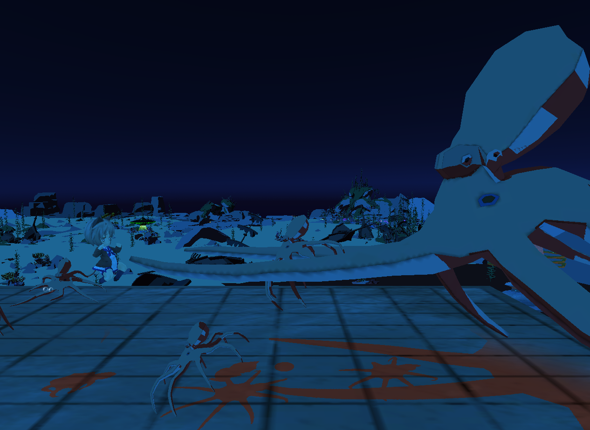

# Portfolio

- 坂本 博斗
- 連絡先 Email [sakamodat.1.2.2@gmail.com](sakamodat.1.2.2@gmail.com)
- 専門学校デジタルアーツ東京 ゲームプログラムコース 2026年卒業予定

## スキル
- C#
  - 利用歴半年
  - Visual Studioで簡単なプログラムを開発可能
- Unity
  - 利用歴半年
  - チーム作品の開発経験あり
- C/C++
  - 利用歴半年
  - コンソールで簡単なデータ処理プログラムを開発
- HTML
  - 利用歴1年
  - 簡単なWebサイトを製作可能

## 取り組んでいるテーマ
1. オリジナルゲーム開発

## 作品リスト

### GalaxySTELLA

[GalaxySTELLA](リンク)

新薬してくる地球外生命体を倒していく2Dシューティングゲームです。

- 開発環境：Unity2020.3.4f1
- 開発期間：2024/9/5-11/9
- グループ開発作品。DATフェスタにて展示。
- サポートとして参加し、背景のスクロールと敵のスポナーのシステムを担当。

### 水中探索

[リンク](リンク)

相棒のドローンで敵を倒しながら進んでいく、横スクロールアクションです。

- 開発環境：Mind Render ver2.2.27.0
- 開発期間：2024/8/23-2024/9/5
- Mind Renderにて公開中

## 連絡先
- E-mail [sakamodat.1.2.2@gmail.com](sakamodat.1.2.2@gmail.com)